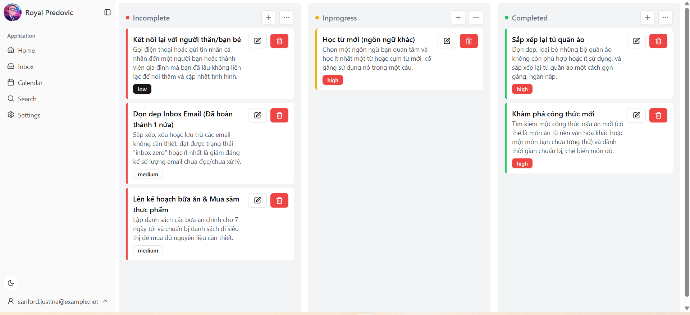

# Todolist-v3

<a alt="Nx logo" href="https://nx.dev" target="_blank" rel="noreferrer"></a>

✨ Your new, shiny [Nx workspace](https://nx.dev) is almost ready ✨.

[Learn more about this workspace setup and its capabilities](https://nx.dev/getting-started/tutorials/react-standalone-tutorial?utm_source=nx_project&utm_medium=readme&utm_campaign=nx_projects) or run `npx nx graph` to visually explore what was created. Now, let's get you up to speed!

## Build With

[![React][React.js]][React-url]  
[](https://www.typescriptlang.org)  
[](https://tailwindcss.com)  
[](https://ui.shadcn.com)

## Run tasks

To run the dev server for your app, use:

```sh
npx nx serve todolist-v3
```

To create a production bundle:

```sh
npx nx build todolist-v3
```

To see all available targets to run for a project, run:

```sh
npx nx show project todolist-v3
```

These targets are either [inferred automatically](https://nx.dev/concepts/inferred-tasks?utm_source=nx_project&utm_medium=readme&utm_campaign=nx_projects) or defined in the `project.json` or `package.json` files.

[More about running tasks in the docs &raquo;](https://nx.dev/features/run-tasks?utm_source=nx_project&utm_medium=readme&utm_campaign=nx_projects)

## Add new projects

While you could add new projects to your workspace manually, you might want to leverage [Nx plugins](https://nx.dev/concepts/nx-plugins?utm_source=nx_project&utm_medium=readme&utm_campaign=nx_projects) and their [code generation](https://nx.dev/features/generate-code?utm_source=nx_project&utm_medium=readme&utm_campaign=nx_projects) feature.

Use the plugin's generator to create new projects.

To generate a new application, use:

```sh
npx nx g @nx/react:app demo
```

To generate a new library, use:

```sh
npx nx g @nx/react:lib mylib
```

You can use `npx nx list` to get a list of installed plugins. Then, run `npx nx list <plugin-name>` to learn about more specific capabilities of a particular plugin. Alternatively, [install Nx Console](https://nx.dev/getting-started/editor-setup?utm_source=nx_project&utm_medium=readme&utm_campaign=nx_projects) to browse plugins and generators in your IDE.

[Learn more about Nx plugins &raquo;](https://nx.dev/concepts/nx-plugins?utm_source=nx_project&utm_medium=readme&utm_campaign=nx_projects) | [Browse the plugin registry &raquo;](https://nx.dev/plugin-registry?utm_source=nx_project&utm_medium=readme&utm_campaign=nx_projects)

[Learn more about Nx on CI](https://nx.dev/ci/intro/ci-with-nx#ready-get-started-with-your-provider?utm_source=nx_project&utm_medium=readme&utm_campaign=nx_projects)

## Install Nx Console

Nx Console is an editor extension that enriches your developer experience. It lets you run tasks, generate code, and improves code autocompletion in your IDE. It is available for VSCode and IntelliJ.

[Install Nx Console &raquo;](https://nx.dev/getting-started/editor-setup?utm_source=nx_project&utm_medium=readme&utm_campaign=nx_projects)

## Feature:

- Drop/Drag Todos
- Create todo
- Edit todo
- Delete todo
- Delete multiple todo by status
- Mark completed todo by status
- Filter todo by status (Keban board)
- Login/Logout
- Scroll


